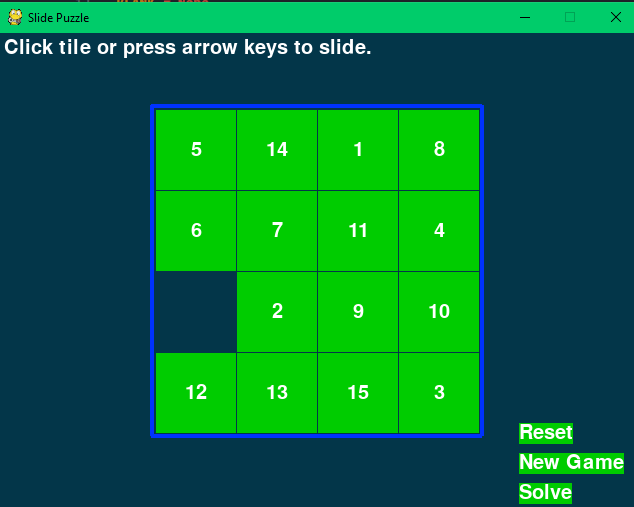

# Some 2D-Games Using Pygame

A repository of some 2D games

- sliding-puzzle Game

---

# SLIDING PUZZLE GAME



The board is a 4x4 grid with fifteen tiles (numbered 1 through 15 going left to right) and one
blank space. The tiles start out in random positions, and the player must slide tiles around until
the tiles are back in their original order.

There are three options:

- Reset
- New Game
- Solve

Reset will rearrange the positions of the tiles.

New game will create another combination of tiles.

Solve will solve the puzzle for you.

## Run

---

To run the game python and pygame should be installed.
To install pygame open command prompt and type

```BASH
pip install pygame
```

then type

```BASH
python sliding_puzzle.py
```

And voila. Now you can play the game.
